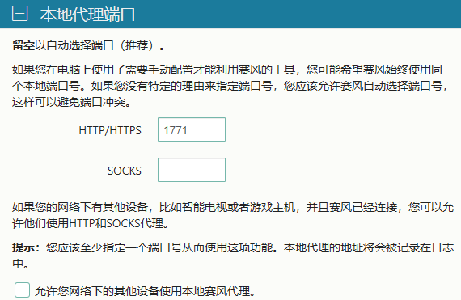

# 进入互联网

## 将运行Psiphon的主机作为代理服务器

| 主机 | 操作系统 | 端口 | 应用程序 | 功能 |
| :--: | :---: | :---: |  :---:| :--- |
| Client (192.168.3.175) | MacOS | 任意 | | 代理应用发送代理请求到192.168.3.104:1991 |
| Proxy (192.168.3.104) | Win 10 | 1991 | svhost.exe | 转发192.168.3.104:1991请求到127.0.0.1:1771 |
|Proxy (192.168.3.104) | Win 10 | 1771 |Psiphon | 接收127.0.0.1:1771代理请求 |

 

## 在Proxy主机上
- 以管理员身份运行命令行：

  

### 1、运行Psiphon并开启Psiphon的本地代理功能

- 查看127.0.0.1:1771端口占用（应有psiphon-tunnel-core.exe监听1771端口的）
- 在Windows的命令行中执行：

    netstat -ano | findstr 1771
  

### 2、启动windows的端口转发功能让1991转到1771
- 在Windows的命令行中执行：

    netsh interface portproxy add v4tov4 listenport=1991 listenaddress=192.168.3.104 connectport=1771 connectaddress=127.0.0.1 protocol=tcp
  

### 3、允许入站请求
- 在Windows的命令行中执行：

    netsh advfirewall firewall add rule name="Open Port 1991" dir=in action=allow protocol=tcp localport=1991
- 查看1991端口监听（应该有svhost.exe监听1991端口的）
    -   在Windows的命令行中执行：

        netstat -ano | findstr 1991
    
- 如果1991端口没有被监听，可以重启IP Helper服务

  

### 4、（可选）开启Proxy主机的ICMP入站请求，可以ping一下Proxy的IP地址
- 在Windows的命令行中执行：
    
    netsh advfirewall firewall add rule name="All ICMP V4" protocol=icmpv4:any,any dir=in action=allow
  
  

## 在Client主机上
- （可选）使用代理访问谷歌

    curl -x 192.168.3.104:1991 www.google.com
  

### 设置代理：可以选择1或者2（如果2支持的话）

### 1、 在主机设置并启用代理
服务器：192.168.3.104

端口：1991

  

### 2、 在Psiphon上设置上游代理
- 桌面端Windows运行software/psiphon3-on-windows.exe并设置上游代理如下：

    

  

- 移动端安装software/PsiphonAndroid.apk，运行Psiphon并设置上游代理如下：

    

    

